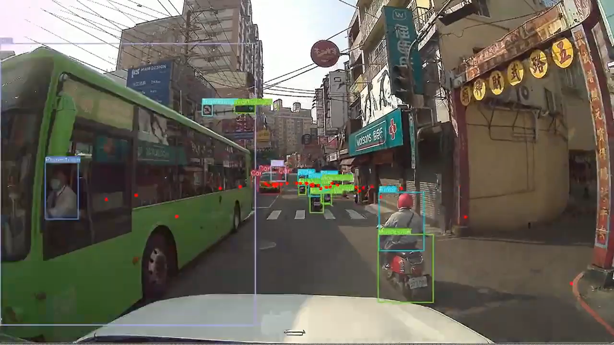
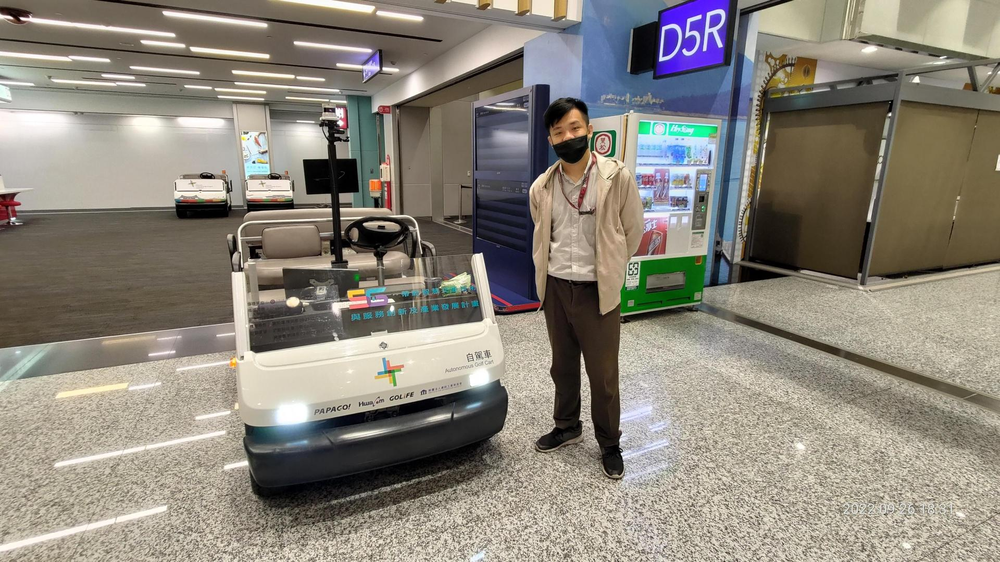
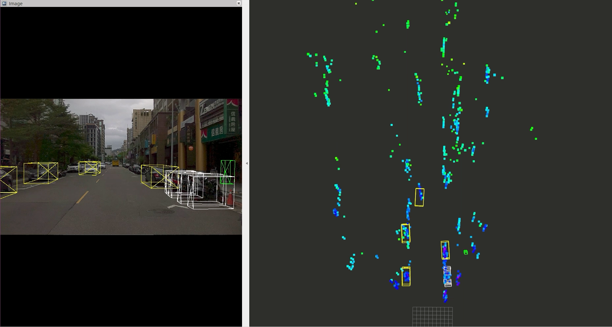
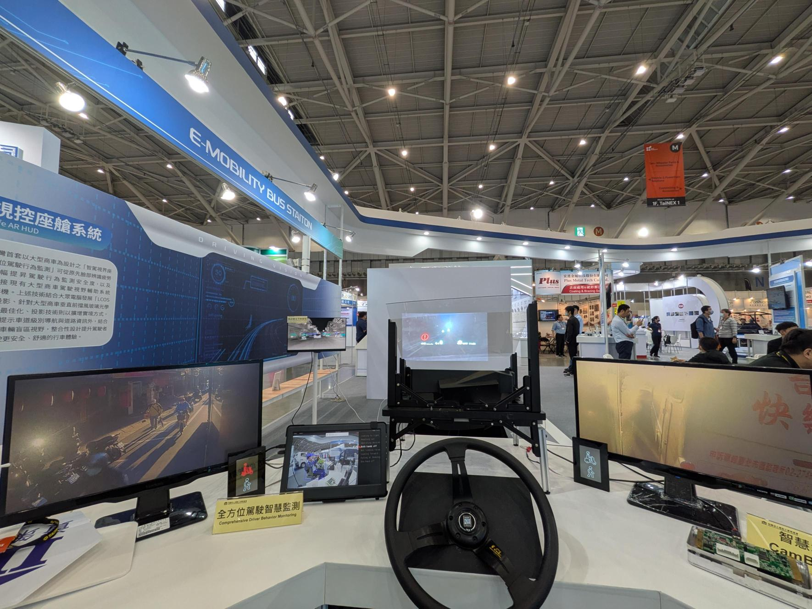
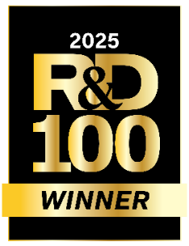
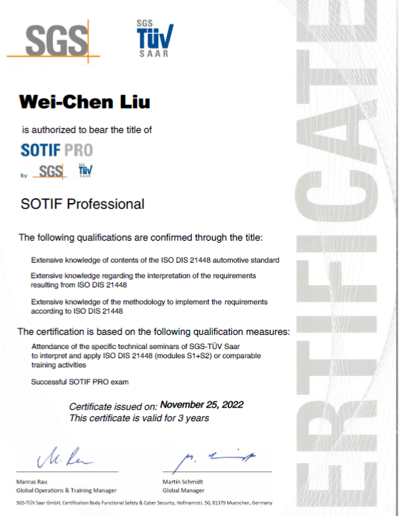

# 劉 暐辰（Wei-Chen Liu）

**車載AI認識・マルチセンサシステムアーキテクト**  
台湾・台北  

📧 chien0928@gmail.com  
🔗 https://www.linkedin.com/in/wei-chen-liu-a83655132/

R&D 100 Award 受賞 | SOTIF（ISO 21448）Professional

---

## 職務要約

車載AI認識システムおよびマルチセンサ知覚技術において8年以上の実務経験を有する。  
カメラ、熱画像、LiDAR、4Dミリ波レーダーを用いたADAS向け認識システムの開発、  
大規模データセット構築、システム統合および実環境検証に従事。

台湾代表的なマルチセンサ道路データセット **FORMOSA** の設計・構築を主導。  
また、大型商用車向けスマートコックピットシステム **VisionSafe** の開発をリードし、  
**2025年 R&D 100 Award** を受賞。

センサキャリブレーション、データセット設計、認識アルゴリズム開発、  
システム統合および実証まで一貫した技術経験を有する。

---

## 技術スタック

**プログラミング**

C++, Python

**AI / 機械学習**

PyTorch, ONNX, TensorRT

**コンピュータビジョン**

OpenCV, Deep Learning Perception

**ロボティクス / ミドルウェア**

ROS, RViz

**センサ**

Camera, Thermal Imaging, LiDAR, 4D Radar, GPS/IMU

**ハードウェアプラットフォーム**

NVIDIA Jetson, Edge AI SoC

**車載システム**

CAN Bus integration, MDVR systems

---

## 専門分野

### 車載AI認識

- マルチセンサ認識システム設計
- AI-ADASアルゴリズム開発
- 認識パイプライン最適化
- 実環境データによる性能検証

### マルチセンサデータセット構築

- データセットアーキテクチャ設計
- センサキャリブレーションおよび同期
- 物体レベルアノテーション設計
- 大規模深層学習データセット構築

### システム統合

- 認識〜制御パイプライン統合
- 自動運転実証
- エッジAI実装
- AR-HUD安全表示システム

---

## 職務経歴

### Institute for Information Industry（III）, Taiwan

#### Section Manager – Intelligent Mobility & AI Systems  
2024年3月 – 現在

- 車載AI認識およびスマートコックピットシステム開発をリード
- カメラ、熱画像、LiDAR、4Dレーダーを統合したマルチセンサ認識プロジェクト管理
- アルゴリズム、データエンジニアリング、システム統合チームの技術統括
- 商用車向けAI-ADASシステムの産業連携推進

---

#### Software Engineer – Automotive AI & Perception Systems  
2017年10月 – 2024年2月

- 車載AI認識アルゴリズム開発
- 自動運転向けマルチセンサデータセット構築
- 多様な交通環境における性能評価
- 自動運転およびスマートモビリティ実証プロジェクト参画

---

## 主なプロジェクト

### FORMOSA Dataset  
**台湾マルチセンサ自動運転データセット**

役割：主要設計・実装メンバー

台湾代表的なマルチセンサ自動運転データセットを設計・構築。

主な内容：

- マルチセンサデータセットアーキテクチャ設計
- センサキャリブレーションおよび同期
- クロスセンサ物体アノテーション設計

対応センサ：

- Camera
- Thermal Imaging
- LiDAR
- 4D Radar
- GPS/IMU

用途：

- 自動運転認識AI研究
- マルチセンサAIモデル学習
- 産学連携研究

---

### 桃園国際空港 自動運転シャトル実証

役割：技術リード

桃園国際空港における実環境自動運転シャトル実証プロジェクト。

主要成果：

- 位置推定遅延 **< 40 ms**
- 認識〜制御処理 **< 60 ms**
- 3か月間で **3,000回以上の乗客輸送**

統合技術：

- AI認識システム
- 高精度地図
- 自動運転ナビゲーション制御

---

### 4D Radar AI Perception Collaboration

4Dミリ波レーダー認識技術の共同開発。

主な取り組み：

- レーダーデータセット構築
- 物体検出モデル開発
- レーダー認識評価フレームワーク設計

用途：

- 商用車ADASシステム

---

### VisionSafe Smart Cockpit System  
**R&D 100 Award（2025）受賞**

商用車向けAIスマートコックピットシステム。

システム特徴：

- AI-ADAS認識モジュール
- AR-HUDリアルタイム安全表示
- 熱画像と可視光のマルチセンサ認識

成果：

- 悪天候・死角事故リスク低減
- **CES 2025** 展示
- **R&D 100 Award** 受賞

---

## 論文・受賞

**R&D 100 Award（2025）**

VisionSafe Smart Cockpit Solution

**SOTIF（ISO 21448）Professional**

SGS TÜV Saar

**IEEE ICIEB 2021**

All-Weather Automotive Perception:  
AI-ADAS using Fusion of Thermal Imaging and RADAR Sensors

---

## 学歴

**国立台湾師範大学**
修士  
電機工学

**国立台湾師範大学**
学士  
電機工学
